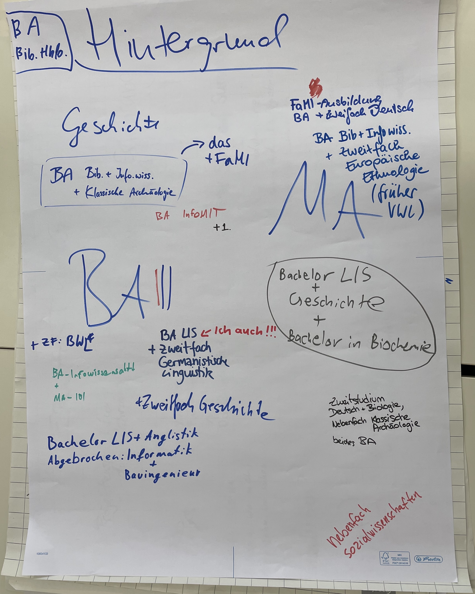
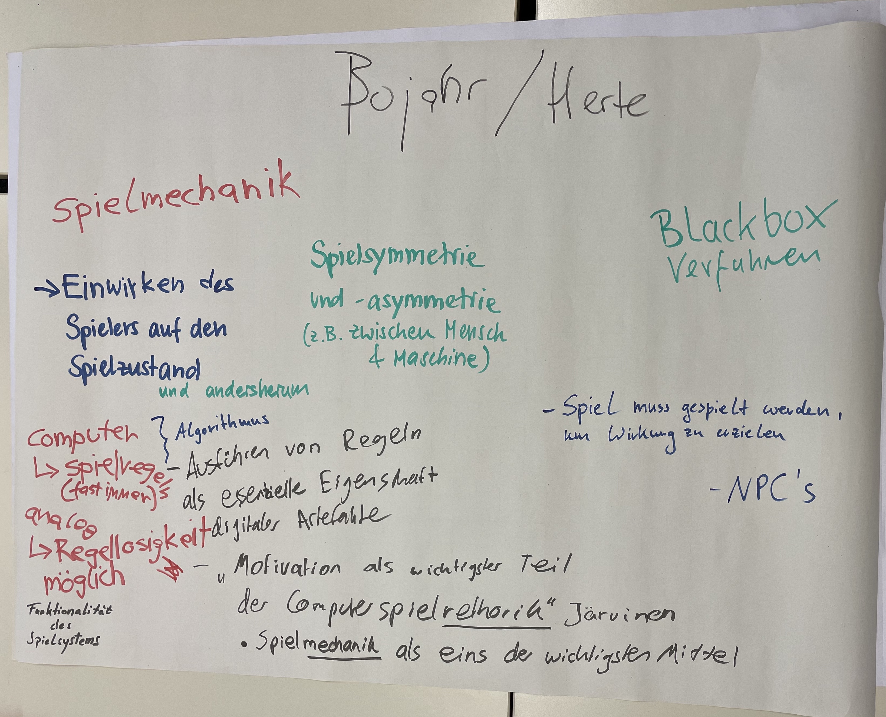
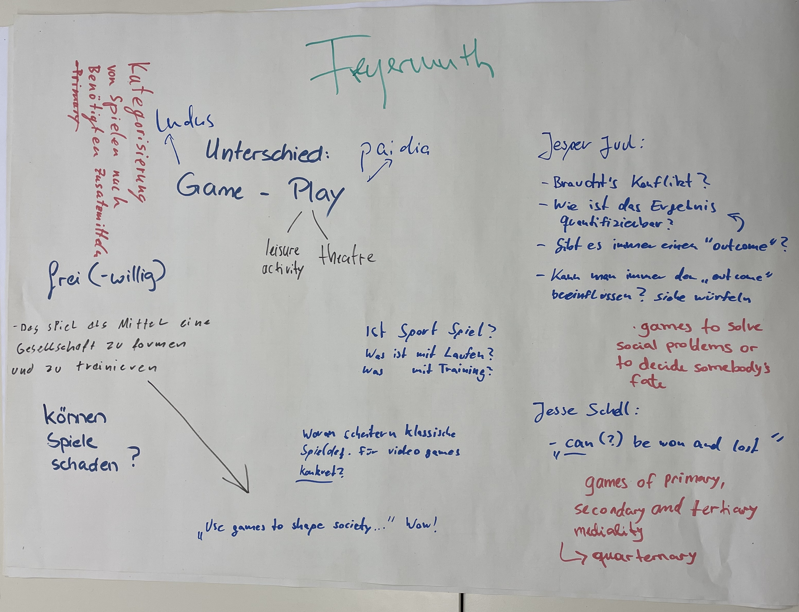
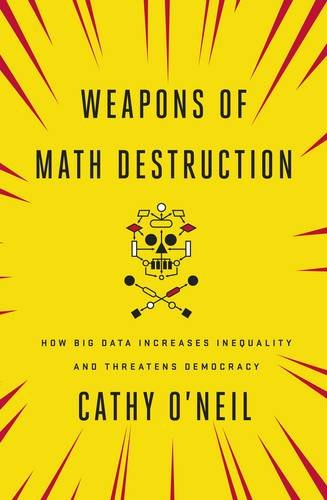
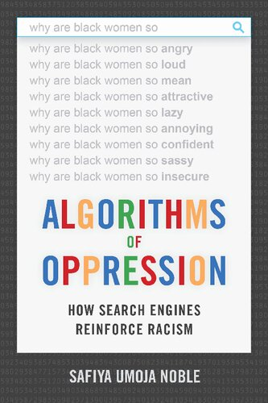

# Rückblick
# Vorstellungsrunde
## Wo kommen Sie her?

## Was bringen Wir an Spielerfahrungen mit?

## Was können Sie mit Digitalität und Digital Humanities anfangen?

## Was erwarten Sie sich?

# Projektseminar
## Ziele

::: columns
:::: column

### Projektziele

- Die vorangegange Vorstellungsrunde soll für den *Scholarly Makerspace* als ein Spiel gestaltet werden
- Kennenlernen der Bedürfnisse potentieller Nutzer_innen des *Scholarly Makerspace*s bzw. die Identifizierung von Nutzergruppen

::::
:::: column

### Lernziele

- Design, Durchführung und Auswertung von User Surveys
* Gamifizierung als Konzept und Praxis mit simplen digitalen Werkzeugen
* Gemeinsame schriftliche Projektdokumentation

::::
:::

## Zeitaufwand

::: columns
:::: column

30 h

Kontaktzeit: 8 Sitzungen

- alle 2 Wochen
- 10--14 Uhr

::::
:::: column

270 h

Selbständiges Arbeiten

::::
:::

## Leistungspunkte

::: columns
:::: column

### Seminar: 4 LP

- Aktive Mitarbeit
- Entwicklung, Durchführung und Auswertung eines Survey
- Zwischenpräsentation & Abschlusspräsentation

### MAP: 6 LP

- Portfolio (Dokumentation der Arbeit im Seminar)

::::
:::: column

### Gesamt: 10 LP

::: alert
Sie können nur das Seminar besuchen, ohne die MAP zu absolvieren --- Es ist aber wenig sinnvoll
:::

::::
:::

# Spiel und Spielen
## Was ist Spiel und Spielen?

::: columns
:::: column

### Erfahrungen

+ Spielrunde: analog und digital
+ Sammlung
    * unsere Erfahrungen
    * Arbeitsdefinitionen
    * Komponenten von *Spiel* und *Spielen*

::::
:::: column

### Lektüre

+ @Freyermuth2015Games
+ @BojahrHerte2018Spielmechanik
+ Wie ändert sich unsere Sicht auf *Spiel* und *Spielen* durch die Lektüre?

::::
:::

## Was ist Spiel und Spielen?

## Was ist Spiel und Spielen?

## Was ist Spiel und Spielen?

## Lektüre: 
### @BojahrHerte2018Spielmechanik

::: notes

- Wie sieht es mit dem analytischen Textverständnis aus?
    + Nacherzählung
    + Zusammenfassung
    + Bewertung und Einordnung 
 
:::

## Lektüre
### @Freyermuth2015Games

::: notes

- Englisch als Herausforderung

:::

# Datenschutz und Co.
## Datenschutz und Co.

::: columns
:::: column

::::
:::: column

::::
:::

# Ausblick 2. Dezember
## Themen

- *Digital Humanities* 
- der *Scholarly Makerspace* an der UB

## Aufgaben

- Finden Sie Antworten auf folgende Fragen
    1. "was sind/ist Digital Humanities?"
    2. "warum sind Blackboxen ein Problem?"
    2. "was ist ein Makerspace?"

## Peek preview  Ein *Scholarly Makerspace*

>Im Wesentlichen geht es bei der Makerbewegung um das Teilen von **Räumen**, **Ressourcen** und **Wissen** innerhalb einer **Gemeinschaft**. Diese Ressourcen stehen Einzelpersonen privat oft nicht zur Verfügung. Die Ermöglichung des Zugangs für alle, stellt so einen zentralen Faktor für eine offene und demokratische Gesellschaft dar. [@Heinzeletal2020Einleitung, 2]

## Ein Makerspace, aber für was?

::: notes

- Werkstätten für Selbermacher:innen
    + Fab Lab, 
- „Makerspace“ hieß  ursprünglich auch die erste kommerziell betriebene Werkstatt bei der 3D-Drucker  gemietet und genutzt werden konnten (HATCH 2013)

:::

## Ein Makerspace, aber für was?

## Ein **Scholarly** Makerspace!

::: columns
:::: column

::::
:::: column

::::
:::

## Unser *Scholarly Makerspace*

::: columns
:::: column

::::
:::: column

::::
:::

# Schluß
## Literatur {#refs}