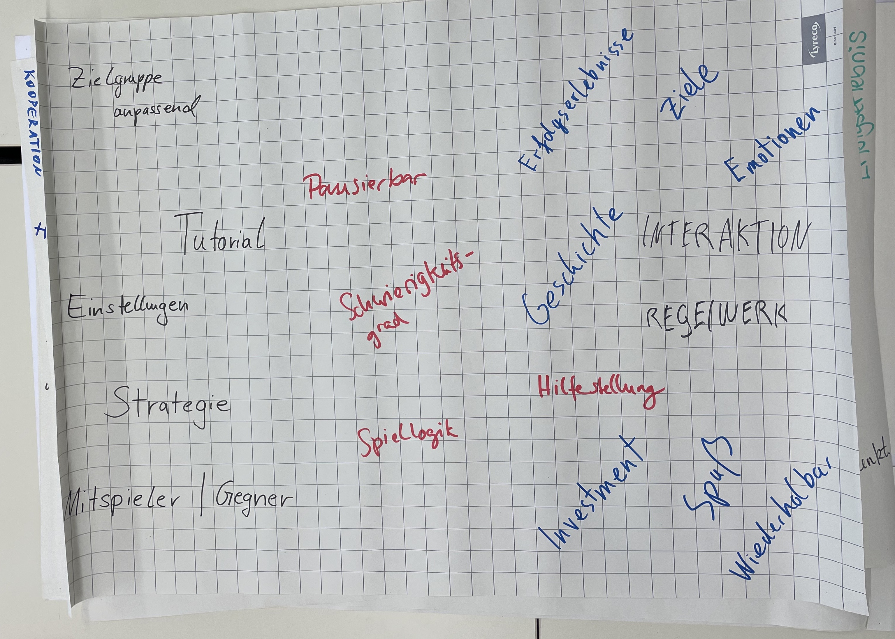

# Das war der Plan
## Ziele

::: columns
:::: column

### Projektziele

- Die Vorstellung der Nutzer_innen des *Scholarly Makerspace* soll als ein Spiel gestaltet werden
- Kennenlernen der Bedürfnisse potentieller Nutzer_innen des *Scholarly Makerspace*s bzw. die Identifizierung von Nutzergruppen

::::
:::: column

### Lernziele

- Design, Durchführung und Auswertung von User Surveys
* Gamifizierung als Konzept und Praxis mit simplen digitalen Werkzeugen
* Gemeinsame schriftliche Projektdokumentation

::::
:::

# Das haben wir gemacht
## Was bringen Wir an Spielerfahrungen mit?

## Was können Sie mit Digitalität und Digital Humanities anfangen?

## Was erwarten Sie sich?

## Thematische Sitzungen

1. Was ist Spiel und Spielen?
2. Digital Humanities und ein *Scholarly Makerspace*
3. User Surveys
    - Formierung der Arbeitsgruppen
4. Weihnachtspause
5. Feedbackschleifen
    - Pretests, Fragen, Usability
    - Scholarly Makerspace
    - Werkzeugbegriff und Klassifizierung von Verfahren der DH

# Was ist Spiel und Spielen?
## Was ist Spiel und Spielen?

>Der Mensch spielt nur, wo er in voller Bedeutung des Wortes Mensch ist, und er ist nur da ganz Mensch, wo er spielt.

<cite>[@Schiller2018AesthetischeErziehung]</cite>

>Salen and Zimmerman isolate common elements, specifically the rule-governed, goal-oriented nature of games, as well as their voluntariness and artistic character, in order to distill their own definition. For one: “Play is free movement within a more rigid structure.”7 And for another: “A game is a system in which players engage in an artificial conflict, defined by rules, that results in a quantifiable outcome. 

<cite>[@Freyermuth2015Games, 36]</cite>

+ [@Caillois2017SpieleUndMenschen, 33]
    * *paidia*: informelles Spiel, von gr. *Kinder*
    * *ludus*: formelles, geregeltes Spiel, von lat. *Grundschule*

## Was ist Spiel und Spielen?

## Was ist Spiel und Spielen?

## Was ist Spiel und Spielen?

# Was sind DH?
## DH are many things to many people

>Digital Humanities? Gibt’s doch gar nicht!

<cite>@Sahle2015DigitalHumanities</cite>

::: columns
:::: column

- Eine Fehlbezeichnung: Wer spricht denn von "digitaler Physik"?
- Ein Label: mit viel symbolischem Kapital
- Methodologische Ansätze: resultieren in Community/ies of Practice

::::
:::: column

- Gemeinschaft(en): big tent, multiple tents, "your DH is not my DH!"
- Eine Disziplin: mit eigener Geschichte und Institutionen
- [Weitere Optionen](https://whatisdigitalhumanities.com/)

::::
:::

::: notes

- presents a random selection from 791 definitions from the "Day of DH" between 2009--14

:::

## *Scholarly Makerspace*  Ein Lernort für digitale Werkzeugkompetenz in den Humanities

>Do artefacts have politics? [@Winner+1980]

>The Cloud *is* a factory. Your AI *is* a human. Sexism *is* a feature, not a bug. [@Mullaney2021Intro, 7]

Stärkung der *tool literacy* (Werkzeugkompetenz) für:

::: columns-3
:::: wide

+ **Teilhabe** an der Digitalität durch computationelle Methoden,
+ kritische **Reflexion** über ein neues epistemisches Paradigma,
+ Genese **neuer Erkenntnisse**

::::
:::: narrow

::::

:::: narrow

 generiertes Bild<!--: "knight sitting in a student library, wearing in a Renaissance full body armour, with a closed tournament helmet, frantically tipping into an large desktop computer from the 2000s on the table in front of him" (Quelle: Torsten Hiltmann)-->](https://furesh.github.io/slides/assets/images/dell-e_knight.png)

::::
:::

## Werkzeuge?

<pre class="mermaid">
flowchart LR
    %% nodes
    software[Software]
    hardware[Hardware]
    method(Methods)
    theory(Theories)
    format[Formats]
    language[Languages]
    concept(Concepts)

    %% edges: note that the layout does not imply hierarchies
    theory -->|informs| method
    method -->|is implemented\nby| software
    software -->|has use| method
    method & format & language -->|uses| concept
    software -->|requires| hardware
    software -->|is written in| language
    software -->|interaction requires| language
    software -->|reads| format
    software -->|writes| format

    %% classes
    classDef software fill:#ECA7F9
    classDef language fill:#F24726
    classDef concept fill:#F9C710
    classDef format fill:#8BCA4B
    classDef method fill:#7ce5cb
    class method method
    class software software
    class concept concept
    class format format
    class language language
</pre>

# Abschlusspräsentationen
# Vielen Dank!
## Literatur